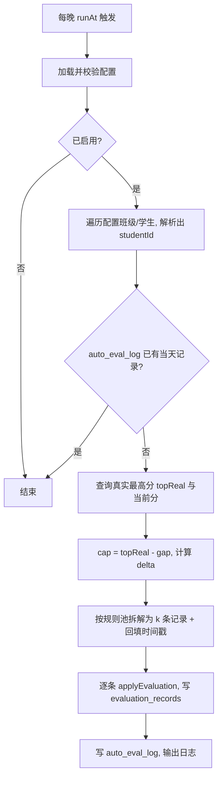

## 产品概述

在教师端后端新增一个"配置驱动的自动评价（后门）"能力：给配置文件中指定班级的指定学生，每晚自动补录若干条已完成的加减分记录，让这几个由运营手动创建的学生始终作为"追赶者"参与班级排名竞争，制造与真实学生的竞争氛围。

## 核心功能

- **配置驱动**：一个 JSON 配置文件声明「班级 + 学生 + 参数」，学生可按姓名或 ID 匹配；支持总开关、运行时刻、时区，每个班级/学生可单独覆盖参数。
- **每晚一次性补录**：每天固定时刻（默认 20:30，Asia/Shanghai）为每个后门学生一次性写入当天若干条评价记录，条数 2~4 条（周末 1~2 条），时间戳回填到当天可信时段（上课 / 晚间），不产生未来时间。
- **每日净增区间波动**：每天净加减总量在配置区间内随机取整波动；周末按系数减量，且以"家庭"类项目为主，避免"周末也在上课"的违和感。
- **永不当第一（硬上限）**：以班级内排除全部后门学生后的真实最高分为天花板，接近时停止加分，已超过时用扣分缓慢回落（单日跌幅受限），最高只能排到第二名。
- **自然度细节**：使用班级可见的真实评价规则（全局规则 + 该班教师自定义规则），优先 1~3 分小分值，按概率混入 1 条扣分，同日不重复同一理由，宠物经验/等级随正常链路联动。
- **幂等与可观测**：同一天重复执行（重启、手动触发）不重复加分；管理端提供手动触发接口便于验证。

## 技术栈

沿用现有后端：Node.js（ESM）+ Express + better-sqlite3（SQLite）。不引入新依赖（定时任务沿用 `setTimeout` 自递归范式，随机数用内置 `Math.random`），不改动前端。

## 实现方案

### 整体策略

新增一条独立于教师手动评价的落库链路：**夜间批处理（每日一次）→ 计算当日净增 → 拆解为真实规则记录 → 回填时间戳写入 `evaluation_records`**，全部复用现有 `applyEvaluation` 的积分/宠物经验/毕业徽章逻辑，只在入参上增加可选的 `timestamp`，保证数据与手动评价完全一致、无"幽灵分数"。

### 关键技术决策与权衡

1. **为什么不白天分散释放**：已确认采用"每晚一次性补录"，实现最简单（单定时器 + 单次批处理），代价是白天家长端看不到过程；因此用"时间戳回填到当天上课时段"补偿自然度。
2. **为什么复用 `applyEvaluation` 而不是直接 UPDATE**：直接改 `total_points` 会出现"总分高但无记录支撑"的破绽，且会绕过宠物经验/等级/徽章；复用后宠物成长、家长端详情页、撤销接口全部天然一致。
3. **为什么必须留 gap 而不是"等于第一名"**：`sortRanking` 同分时按 `pet_level` 降序，打平有概率仍排第一；故 `cap = topReal - gapToTop`（默认 2）。
4. **为什么不主动追赶（target−gap）**：已确认采用"仅硬上限"，每日增量纯随机，仅在触顶时收敛，观感更随机自然。
5. **为什么需要幂等表**：服务器重启、容器多次启动、手动触发都会导致同一天重复执行；`auto_eval_log` 的 `UNIQUE(student_id, eval_date)` 是唯一可靠防线（不依赖进程内状态）。

### 核心算法

- 天花板：`topReal = MAX(total_points)`（`students WHERE class_id = ? AND id NOT IN (全部后门学生)`）；`cap = topReal - gapToTop`；`headroom = cap - current`。
- 区间：`[lo, hi]` 取配置 `dailyMin/dailyMax`，周末乘 `weekendFactor` 后取整。
- 取值：
- `headroom >= lo` → `delta = randInt(lo, min(hi, headroom))`；
- `headroom < lo`（已逼近/超过） → `delta = min(-1, max(headroom, -maxDailyDrop))`，保证至少回落 1 分且单日跌幅不超过 `maxDailyDrop`（默认 `max(3, hi)`），避免"一天暴跌"露馅；
- 无真实学生 / 取不到 `topReal` → 跳过并记日志原因。
- 拆解：平日 2~4 条、周末 1~2 条；规则池 `is_custom = 0 OR user_id = 班级所有者`，平日以 学习/行为/健康/其他 为主、周末以 家庭 为主；按 `negativeChance`（默认 0.3）安排 1 条 −1/−2 扣分；同日 reason 去重；贪心凑数、余量用 ±1 规则补齐，凑不齐时允许小幅偏差（仍需 ≤ cap 且方向一致）。
- 时间戳：在当日时段内取 k 个互异时刻并排序，间隔 ≥ 20 分钟，全部 ≤ 运行时刻。平日 08:00–11:30 / 13:30–16:30 / 19:00–20:30；周末 09:30–11:30 / 15:00–17:30 / 19:00–20:30。
- 冷却：`applyEvaluation` 的 60 秒冷却按真实 `now` 判断，回填过去时间戳不会误触；同日 reason 去重作为双保险。

### 性能与可靠性

每晚一次、每班仅数名学生，SQL 量级为个位数（规则池一次查询 + 排名一次聚合 + 每生 2~4 次写入），无性能风险。`idx_records_student_id`、`idx_students_class_id` 已有索引可直接利用。单生失败不影响其他学生（try/catch 隔离 + 记录原因）；日志只输出"学生、日期、净增、条数、跳过原因"，不打印完整载荷。



## 实现注意事项（防回归）

- `applyEvaluation` 仅新增可选 `timestamp` 参数（默认 `Date.now()`），现有 `routes/evaluations.js` 调用行为零变化。
- `db.js` 的建表用 `CREATE TABLE IF NOT EXISTS` 追加到 `statements` 数组末尾，不改既有表结构；不做任何数据迁移/删除，不触碰生产库 `prod/data/pet-garden.db`。
- 调度器必须 `unref()` 并在 `shutdown()` 中清理，否则影响优雅退出；默认 `enabled: false`，未配置时完全不启动，对现有部署零影响。
- 配置查找顺序：`AUTO_EVAL_CONFIG` 显式路径 → `<server>/config/autoEval.json` → `<server>/../config/autoEval.json`；找不到或校验失败只告警不启动，绝不因配置错误导致服务启动失败。
- 后门学生集合需在计算 `topReal` 时整体排除（含同班其他后门学生），否则会互相"抬天花板"导致双双冲顶。

## 架构设计

后端分层，与现有 `routes / services / utils` 约定一致：

- 配置层 `utils/autoEvalConfig.js`：读文件 + 结构校验 + 默认值填充，纯函数、无副作用。
- 领域层 `services/autoEvalService.js`：上限计算、delta 随机、规则拆解、时间戳回填、落库与日志；依赖 `db` 与 `evaluationService.applyEvaluation`。
- 调度层 `utils/autoEvalScheduler.js`：按 `runAt` 计算延时、`setTimeout` 自递归 + `unref`、返回 stop 函数，风格对齐 `demoResetScheduler.js`。
- 接入层：`index.js` 负责启动/停止；`routes/admin.js` 提供管理端手动触发（仅用于验证与应急补跑）。

## 目录结构

```
admin/server/
├── config/
│   └── autoEval.json                 # [NEW] 后门配置文件：enabled/timezone/runAt + defaults + classes[].students[]（按 id 或 name 匹配）
├── utils/
│   ├── autoEvalConfig.js             # [NEW] 配置加载与校验（路径查找、默认值、合法性校验、按班级展开学生参数）
│   └── autoEvalScheduler.js          # [NEW] 每晚 runAt 定时触发，setTimeout 自递归 + unref，返回停止函数
├── services/
│   ├── autoEvalService.js            # [NEW] 核心服务：topReal/cap 计算、delta 随机与触顶回落、规则池拆解、时间戳回填、逐条落库、写 auto_eval_log
│   └── evaluationService.js          # [MODIFY] applyEvaluation 增加可选 timestamp 参数（默认 Date.now()）
├── routes/
│   └── admin.js                      # [MODIFY] 新增管理端手动触发接口（POST /api/admin/auto-eval/run，可传日期）
├── db.js                             # [MODIFY] initDb 新增 auto_eval_log 幂等表
└── index.js                          # [MODIFY] bootstrap 后启动调度器、shutdown 中停止
```

## 关键代码结构

配置文件形态（`config/autoEval.json`）：

```
{
  "enabled": true,
  "timezone": "Asia/Shanghai",
  "runAt": "20:30",
  "defaults": {
    "dailyMin": 2, "dailyMax": 8,
    "gapToTop": 2, "maxDailyDrop": 4,
    "weekendFactor": 0.5,
    "recordsPerDay": [2, 4],
    "weekendRecordsPerDay": [1, 2],
    "negativeChance": 0.3
  },
  "classes": [
    { "classId": "班级ID", "students": [{ "name": "张三" }, { "id": "学生ID", "dailyMax": 6 }] }
  ]
}
```

核心服务接口（仅签名，不含实现）：

```js
// services/autoEvalService.js
// 对单个学生执行某天的自动评价；返回 { skipped, reason?, delta, records[] }
export async function runAutoEvaluationForStudent(db, { student, classId, config, evalDate, now })

// 批量执行（供调度器与手动接口共用）
export async function runAutoEvaluationForDate(db, { evalDate = 今天, now = Date.now(), config })

// utils/autoEvalScheduler.js
export function startAutoEvalScheduler(db, options)   // 返回 stop 函数
```