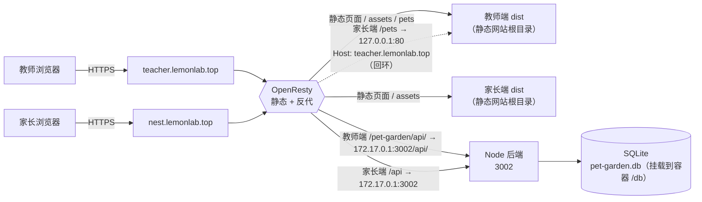

# 生产部署指南（1Panel：OpenResty 托管前端 + Node 运行环境托管后端）

> 面向零基础。照着做即可把「教师端 + 家长端 + 后端」**三个独立服务**全部跑起来。
> 本文档对应**真实服务器（Linux + 1Panel）**部署；本机 Windows 模拟生产部署看 `LOCAL-BUILD.md`，本机联调看 `LOCAL-DEV.md`。
> 其他文档：
> - 本地打包 / 改配置 → `LOCAL-BUILD.md`
> - 本地三端联调 → `LOCAL-DEV.md`

> **本文档的参数来自真实部署环境**（域名、目录、反代规则均为服务器上实际生效的值），可直接照抄。
> 实际部署参数：
> - 教师端：**teacher.lemonlab.top**
> - 家长端：**nest.lemonlab.top**
> - 后端：Node 项目，端口 `3002`
> - 服务器根目录：`/opt/pet-file/`（代码 `run` / 配置 `config` / 数据库 `db` 三者分离挂载）

---

## 0. 先搞清楚：这个项目到底有几个东西？

这个项目看着是一个仓库，实际运行起来是 **3 个独立部分（3 个服务）**：

| 部分 | 源码目录 | 是什么 | 生产域名 | 在 1Panel 里怎么跑 |
|------|----------|--------|----------|--------------------|
| 后端 API | `admin/server` | Node.js + Express，读写数据库 | 无（不对外） | **Node 项目**（Node 运行环境托管），端口 `3002` |
| 教师端 | `admin`（除 `server` 外的部分，构建出 `dist`） | Vue3 前端，纯静态文件 | `teacher.lemonlab.top` | **静态网站**（OpenResty 托管） |
| 家长端 | `nest`（构建出 `dist`） | Vue3 前端，纯静态文件 | `nest.lemonlab.top` | **静态网站**（OpenResty 托管） |

数据库只有一个：**SQLite 单文件**（`pet-garden.db`），由后端进程直接读写，不需要装 MySQL。

部署后的访问链路：



**重点：**
- 教师端和家长端都是静态网页，它们没有自己的数据，全部通过 API 反代找同一个后端。所以**后端只部署一份**。
- 两个前端接口前缀不同：教师端代码里写死 `/pet-garden/api`，家长端默认 `/api`（见 `admin/src/composables/useAuth.ts` 和 `nest/src/api/client.ts`）。后端同时注册了这两个前缀，都能处理。
- 宠物图片在教师端的构建产物里（`dist/pets/`）。家长端不自带图片，靠**反向代理把 `/pets` 指回教师端**来取图（见第 4 节）。
- 这 3 个部分彼此独立：任意一个挂了 / 重启，不影响另外两个。

---

## 1. 服务器要准备什么

### 1.1 软件清单（都在 1Panel 里装，不用命令行）

| 软件 | 怎么来 | 说明 |
|------|--------|------|
| 1Panel | 已安装 | 本文档前提 |
| OpenResty | 1Panel 应用商店安装 | 托管两个静态前端 + 做反向代理 |
| Node 运行环境 | 1Panel 应用商店安装 **20.x LTS**（需 ≥ 20.6.0，后端用 `process.loadEnvFile` 读配置） | 后端跑在它上面，面板替你管理进程和依赖 |

> 不用自己登服务器敲命令装 Node、不用装编译工具链、不用写 systemd——这些 1Panel 都包了。

### 1.2 规划服务器目录（挂载方案）

采用「代码 / 配置 / 数据库」三者分离、各自挂载的方案（服务器上实际路径）：

```
/opt/pet-file/
├── run/        # 后端代码（挂载到容器 /app）
│   ├── index.js
│   ├── db.js
│   ├── package.json
│   ├── routes/  services/  utils/  middleware/
│   └── config/ # 配置目录挂载点（挂载到容器的 /app/config）
├── config/     # 配置文件（挂载到容器 /app/config）
│   └── app.env  # 或任意 *.env，里面写 SQLITE_PATH 等
└── db/         # 数据库目录（挂载到容器 /db）
    └── pet-garden.db
```

1Panel 里把这三个目录分别映射到容器（其中 `run` 与 `config` 是「宿主机目录 → 容器路径」的映射，`db` 也是独立映射）：

| 宿主机目录 | 容器路径 | 内容 |
|------------|----------|------|
| `/opt/pet-file/run`   | `/app`        | 后端源码 |
| `/opt/pet-file/config`| `/app/config` | 配置（`*.env`） |
| `/opt/pet-file/db`    | `/db`         | SQLite 库 |

> **为什么这么分**：更新代码只动 `run/`；改配置只动 `config/`；数据库始终在 `db/`，任何代码更新都不会误伤它。
>
> `/app/config` 是挂进 `/app`（已挂载目录）的子路径，属于**嵌套挂载**，Docker 支持，当前部署环境已验证可用。若你的 1Panel 版本不允许，可改为把配置挂到独立的 `/config`，并相应调整配置载入路径。
>
> 注意：`run/` 目录下**不要**手动再建 `config/` 目录，配置是从宿主机 `config/` 单独挂进去的。

---

## 2. 第一步：部署后端（Node 项目）

### 2.1 上传后端源码

1Panel → 文件管理，把仓库里 `admin/server` **里面的内容**上传到 `/opt/pet-file/run`。

需要的只有这些（测试 / 日志文件不用传）：

```
admin/server/
├── index.js
├── db.js
├── demo-seed.js
├── package.json
├── package-lock.json
├── middleware/
├── routes/
├── services/
└── utils/
```

> ⚠️ **只传源码，不要传你本地的 `node_modules/`**。后端依赖由面板在服务器上自动安装（见 2.2）；本地（尤其 Windows）的 `node_modules` 里 `better-sqlite3` 原生模块在 Linux 上跑不起来。

### 2.2 在 1Panel 创建 Node 项目（自动装依赖 + 自动运行 + 自启）

1Panel → 网站 → 创建网站（或「运行环境 → Node 运行环境 → 创建 Node 项目」），按界面填：

- **项目目录**：选 `/opt/pet-file/run`（对应容器 `/app`）
- **运行环境**：选刚才装的 Node 20（需 ≥ 20.6.0）
- **启动命令**：`node index.js`
- **端口映射**：容器 `3002` → 宿主机 `3002`（必须对外映射，OpenResty 通过 Docker 网关 IP 访问它）
- **目录映射**（在 1Panel 的「挂载 / 目录映射」里加）：
  - `/opt/pet-file/db` → 容器 `/db`
  - `/opt/pet-file/config` → 容器 `/app/config`

确认创建。面板会**自动 `npm install` 安装依赖**（包括把 `better-sqlite3` 在 Linux 上编译 / 拉取预编译二进制），装完**自动运行**，并**开机自启**。你不需要敲命令、不需要写 `.service` 文件。

### 2.3 配置（推荐：配置目录）

后端启动时会自动读取**运行目录下的 `config/` 目录**（即容器 `/app/config`），按以下顺序加载环境变量，后读的覆盖先读的：

1. `./.env`（容器 `/app/.env`）
2. `../.env`（容器上级目录 `.env`）
3. **`./config/*.env`**（容器 `/app/config/*.env`）← 优先级最高

所以 `config/` 目录里的变量会覆盖兜底文件，也会覆盖 1Panel「环境变量」里填的同名项。

在宿主机的 `/opt/pet-file/config/` 下放任意 `*.env` 文件，例如 `app.env`：

```
PORT=3002
SQLITE_PATH=/db/pet-garden.db
TOKEN_SECRET=把 openssl rand -hex 32 生成的那串粘进来
ADMIN_DEFAULT_PASSWORD=换成一个强密码
DISABLE_DEMO=1
PARENT_APP_BASE_URL=https://nest.lemonlab.top
AUTH_RATE_LIMIT_ENABLED=true
AUTH_LOGIN_RATE_LIMIT_MAX=10
AUTH_LOGIN_RATE_LIMIT_WINDOW_MS=60000
```

> `SQLITE_PATH=/db/pet-garden.db` 指向挂载进来的数据库目录，对应宿主机 `/opt/pet-file/db/pet-garden.db`。**这一条是整套挂载方案的关键**：容器内写 `/db`，实际落到宿主机 `db/` 目录。

生成密钥（用 openssl 或任意随机串）：

```
openssl rand -hex 32
```

各变量含义：

| 变量 | 必须？ | 作用 |
|------|--------|------|
| `PORT` | 否（默认 3002） | 后端监听端口，要和 2.2 的端口映射一致 |
| `SQLITE_PATH` | 是 | **数据库文件放哪**，生产固定写 `/db/pet-garden.db` |
| `TOKEN_SECRET` | **是** | 登录 token 签名密钥，生产不配置会启动报错 |
| `ADMIN_DEFAULT_PASSWORD` | 建议改 | 管理员 `admin` 密码（仅首次建账号生效） |
| `DISABLE_DEMO` | 建议 `1` | `1` = 不生成演示数据 |
| `PARENT_APP_BASE_URL` | 建议配 | 教师端「邀请家长」链接用的域名，填**家长端**域名 |
| `AUTH_*` | 否 | 登录 / 注册限流 |

> **不要**同时在 1Panel「环境变量」里填同名变量——若都填，以 `config/` 目录里的为准，容易造成混乱。要么用 config 目录，要么用 1Panel 环境变量，二选一。
>
> 带 `VITE_` 前缀的变量是**前端构建期**注入的，不是后端运行期变量，在这里填了也没用（要改得重新构建前端，见 `LOCAL-BUILD.md`）。

### 2.4 验证后端起来了

在面板该 Node 项目的「日志 / 终端」里看启动输出；或在服务器终端：

```
curl http://127.0.0.1:3002/api/health
# 期望返回：{"status":"ok",...}
```

看到 `ok` 说明后端和数据库都正常了。再看一眼数据库文件是否已生成：

```
ls -l /opt/pet-file/db/
# 应该有 pet-garden.db（以及 -wal、-shm，正常现象）
```

---

## 3. 第二步：部署教师端静态网站（teacher.lemonlab.top）

### 3.1 建静态网站

1Panel → 网站 → 创建网站 → 类型**静态网站**：
- 域名：`teacher.lemonlab.top`
- 根目录：用面板默认值 `/www/wwwroot/teacher.lemonlab.top`

### 3.2 上传 dist

文件管理里进入该站点根目录，把本地构建出的 **`admin/dist` 里面的内容**拖拽上传（即 `index.html` + `assets/` + `pets/`）。

> ⚠️ 上传的是 `dist` **里面**的内容，不要把 `dist` 这一层也传进去。正确：`/www/wwwroot/teacher.lemonlab.top/index.html`、`.../pets/bichon/lv1.webp`；错误：`.../teacher.lemonlab.top/dist/index.html`（会全站 404、图片全裂）。
>
> `pets/` 是宠物图片，**必须一起传**，家长端的图片全靠它（见 4.2）。

### 3.3 配反向代理（页面操作，不写 nginx 配置）

站点 → **反向代理** → 添加规则，按下表填写（字段名与 1Panel 界面一致）：

| 站点 | 匹配规则 | 前端路径（代理目录） | 后端地址 | 后端域名 |
|------|----------|----------------------|----------|----------|
| 教师端 | `^~` | `/pet-garden/api/` | `http://172.17.0.1:3002/api/` | `$host` |

> **约定：凡是本文没特别说明的字段，都用面板默认值。「后端域名」的默认值就是 `$host`**（把访客原始域名原样传给后端）。本环境三条反代规则的后端域名全部是 `$host`，只有家长端 `/pets` 例外（`teacher.lemonlab.top`）。

**两个关键点：**

1. **后端地址必须用 `172.17.0.1`，不能用 `127.0.0.1`。** OpenResty 跑在 Docker 容器里，`127.0.0.1` 指的是它自己；`172.17.0.1` 是 Docker 网桥 / 宿主机网关，从容器里能通过这个地址访问到宿主机上映射出来的 `3002` 端口。实际网关地址以你机器上 `ip addr show docker0` 或 `docker network inspect bridge` 查到的为准（通常是 `172.17.0.1`）。
2. **后端地址末尾的 `/api/` 别漏。** `/pet-garden/api/health` 会被改写成 `/api/health` 后发给后端。

> 后端同时注册了 `/api` 和 `/pet-garden/api` 两套前缀（见 `admin/server/index.js`），所以即使原样透传也能跑；但既然生产按上表配好了，就**不要随意改这一条**，改了要同步验证。

若刷新子页面（如 `/ranking`、`/share/xxx`）出现 404，说明站点缺 SPA 回退；在站点设置里开启 `index.html` 回退（面板的伪静态 / SPA 选项），**不用手写 nginx**。

### 3.4 上 HTTPS（建议）

站点 → 证书 → 申请 Let's Encrypt（域名先解析到本机、80 端口可访问）→ 开启强制 HTTPS。面板自动改好 443 和跳转。

> 开启强制 HTTPS 后，80 端口收到的请求会被 301 到 HTTPS。这会影响家长端 `/pets` 的回环反代（见 4.2 说明）。

---

## 4. 第三步：部署家长端静态网站（nest.lemonlab.top）

### 4.1 建静态网站 + 上传 dist

同理建 `nest.lemonlab.top` 静态网站，根目录用面板默认值 `/www/wwwroot/nest.lemonlab.top`，上传 **`nest/dist` 里面的内容**（不需要 `pets/` 目录，图片走反代）。

### 4.2 配反向代理（两条，都在页面配）

站点 → 反向代理 → 添加规则：

| 站点 | 匹配规则 | 前端路径（代理目录） | 后端地址 | 后端域名 |
|------|----------|----------------------|----------|----------|
| 家长端 | `^~` | `/pets` | `http://127.0.0.1:80` | `teacher.lemonlab.top` |
| 家长端 | `^~` | `/api` | `http://172.17.0.1:3002` | `$host` |

逐条解释：

- **规则 1（宠物图片，`127.0.0.1:80` + `后端域名 teacher.lemonlab.top`）**：家长端的图片路径是 `/pets/bichon/lv1.webp`，这些图只有教师端有。这里故意把请求发给 **`127.0.0.1:80`，也就是 OpenResty 自己**，同时通过「后端域名」把 Host 头设成 `teacher.lemonlab.top`；OpenResty 收到这个请求后按域名匹配，就当作一次对教师端站点的访问，由教师端的静态根目录把图片吐出来。**好处**：不用关心教师端目录在哪、也不用公网 DNS 解析，纯本机回环，最快。
- **规则 2（接口，`172.17.0.1:3002` + `后端域名 $host`）**：`$host` 表示把访客原始的 Host（即 `nest.lemonlab.top`）原样传给后端。后端不校验 Host，写 `$host` 只是保持信息完整。地址必须用 Docker 网关 IP，理由同 3.3。

> ⚠️ 注意规则 2 的后端地址**没有结尾斜杠**：`/api/health` 会原样变成 `http://172.17.0.1:3002/api/health`，正确。如果误写成 `http://172.17.0.1:3002/`（带 `/`），则会变成 `//health`，接口全部 404。**两条规则的写法不能互相照抄。**

**关于规则 1 与教师端「强制 HTTPS」的互相影响（本环境已实测）**

教师端开启了强制 HTTPS，而规则 1 的反代目标是 `http://127.0.0.1:80`，所以家长端取图的完整过程是：

```
浏览器 → https://nest.lemonlab.top/pets/bichon/lv1.webp
       → OpenResty 回环到 127.0.0.1:80，Host=teacher.lemonlab.top
       → 教师端站点判定该请求是 HTTP → 301 到 https://teacher.lemonlab.top/pets/bichon/lv1.webp
       → 浏览器跟随跳转再取一次 → 200 image/webp
```

**结论：会多一次 301 跳转，但最终能正常显示图片，这是本环境的既定行为，不用改。** 验证时请以「最后一次状态码为 200」为准，看到 301 不要误判为配置错误。

只有在意这一次跳转（或不想让家长端页面出现跨域名图片请求）时才需要改，可选：
- 把规则 1 的后端地址改成 `https://teacher.lemonlab.top`（需公网能解析该域名、证书有效；会走公网绕一圈，更慢）；
- 或把 `pets/` 目录复制一份到家长端站点根目录 `/www/wwwroot/nest.lemonlab.top/pets/`，然后删掉这条反代（代价是图片要传两份、发版时要记得同步更新）。

### 4.3 上 HTTPS

同 3.4。

---

## 5. 数据库在哪？怎么备份？

### 5.1 位置

就是 `SQLITE_PATH` 指向的文件，在挂载的数据库目录里：

```
/db/pet-garden.db                  # 容器内路径
/opt/pet-file/db/pet-garden.db     # 宿主机实际路径
```

同目录还会有 `pet-garden.db-wal`、`pet-garden.db-shm`（SQLite 临时文件，**别删**）。

**数据库放在独立的 `db/` 挂载里、和代码完全分开，就是为了让更新代码时不误伤它。**

### 5.2 备份

最简单：文件管理里把 `/opt/pet-file/db/pet-garden.db`（连同 `-wal` / `-shm`）**下载到本地**一份。

或用 1Panel 计划任务跑 Shell：

```bash
DIR=/opt/pet-file/backup
mkdir -p $DIR
STAMP=$(date +%Y%m%d_%H%M%S)
cp /opt/pet-file/db/pet-garden.db* $DIR/pet-garden-$STAMP.db 2>/dev/null
# 只保留最近 30 天
find $DIR -name "pet-garden-*.db" -mtime +30 -delete
```

> 也可以进教师端「数据管理 → 导出备份」导出 JSON（适合迁移单个班级，不能替代整库备份）。

### 5.3 恢复

停掉 Node 项目 → 把备份的 `pet-garden.db` 覆盖回 `/opt/pet-file/db/` → 重新启动 Node 项目。恢复后所有人需重新登录，正常。

---

## 6. 验收清单（逐条打勾）

```
# 后端活着
curl http://127.0.0.1:3002/api/health                        # {"status":"ok",...}
curl http://172.17.0.1:3002/api/health                       # 同上（OpenResty 能触达的地址）

# 教师端接口通（走域名）
curl https://teacher.lemonlab.top/pet-garden/api/health      # {"status":"ok",...}

# 家长端接口通
curl https://nest.lemonlab.top/api/health                    # {"status":"ok",...}

# 家长端宠物图片能取到（经教师端回环）
# 正常现象：先 301 到 teacher 域名（教师端强制 HTTPS），最后 200 image/webp
curl -IL https://nest.lemonlab.top/pets/bichon/lv1.webp
```

浏览器里再确认：
- [ ] 教师端能注册 / 登录，能建班级、加学生、加分
- [ ] 教师端刷新子页面（如 `/ranking`）不 404
- [ ] 教师端宠物图片正常（直接访问 `https://teacher.lemonlab.top/pets/bichon/lv1.webp`）
- [ ] 教师端「邀请家长」能复制出 `https://nest.lemonlab.top/?classId=xxx`
- [ ] 家长端打开邀请链接能看到孩子、能设密码登录
- [ ] 家长端宠物图片正常（不是裂图）

---

## 7. 出问题了怎么办（按现象查）

| 现象 | 原因 / 解决办法 |
|------|------------------|
| Node 项目启动失败，日志写 `生产环境必须配置 TOKEN_SECRET` | 配置没生效。检查 `/opt/pet-file/config/*.env` 是否填了 `TOKEN_SECRET`，且已重启项目 |
| 日志 `SQLITE_CANTOPEN` | `/db`（即 `/opt/pet-file/db`）目录不存在或没写权限；确认挂载已生效、目录可写 |
| 后端起不来但日志里 `SQLITE_PATH =（未设置）` | config 没挂到 `/app/config`，或文件名不以 `.env` 结尾 |
| `Cannot find module 'better-sqlite3'` | 依赖没装上。删掉重新创建 Node 项目让面板重装；若原生编译失败，确认面板 Node 运行环境版本 ≥ 20.6 |
| 配置改了不生效 | 配置在 `config/` 目录，改完需在面板**重启 Node 项目**；注意 `config/` 优先级最高，会覆盖 1Panel 环境变量 |
| 页面能开但接口 502 | 后端没起来；或反代目标写成 `127.0.0.1:3002`（应为 Docker 网关 `172.17.0.1`）。先 `curl 127.0.0.1:3002/api/health` 确认后端本身正常 |
| 教师端接口 404 | 反代「后端地址」少了结尾 `/api/`，或代理目录没写 `/pet-garden/api/` |
| 家长端接口 404 | 反代「后端地址」多了结尾 `/`（应写 `http://172.17.0.1:3002`，无尾斜杠） |
| 家长端图片全裂图 | 教师端根目录没传 `pets/`，或 `/pets` 反代的后端域名没写成 `teacher.lemonlab.top`（写成 `$host` 会变成向自己要图 → 404） |
| 家长端图片请求返回 301 | **正常**：教师端开了强制 HTTPS，回环反代会先 301 到 `https://teacher.lemonlab.top/pets/...` 再 200（见 4.2）。只要最终是 200 就没事；若停在 301/404，再按上一行排查 |
| 刷新子页面 404 | 站点缺 SPA 回退，开面板的 index.html 回退（见 3.3） |
| 页面白屏、一堆 404 | dist 传错位置（多套了一层 `dist`），或站点根目录指错 |
| 邀请链接域名不对 / 是空的 | `PARENT_APP_BASE_URL` 没配或配错，应为 `https://nest.lemonlab.top`，改完重启 Node 项目 |
| 注册提示操作太频繁 | 限流生效，`AUTH_REGISTER_RATE_LIMIT_MAX` 默认严，调大后重启项目 |
| 改了 `VITE_*` 没生效 | 那是构建期变量，必须重新构建前端并重新上传 dist |

**看日志**：后端在 Node 项目的「日志」里看；前端在站点「日志」里看。不用登服务器 `tail`。

---

## 8. 以后怎么更新发版（⚠️ 别动数据库）

```text
1. 本地重新构建两个前端（见 LOCAL-BUILD.md），得到新的 admin/dist、nest/dist。
2. 文件管理里上传覆盖两个静态站点根目录（只覆盖 dist 内容）。
3. 若后端代码也改了：上传覆盖 /opt/pet-file/run 的源码。
   ★★★ 只覆盖代码文件，绝对不要删除或覆盖 /opt/pet-file/db/ 目录 —— 那是数据库！★★★
4. 在面板里重启对应的 Node 项目（或重新创建让它重装依赖）。
5. 验证：curl http://127.0.0.1:3002/api/health，再走一遍第 6 节。
```

**更新不会动到数据库**：数据库在独立的 `/opt/pet-file/db/` 挂载，和源码（`/opt/pet-file/run`）分开。上传覆盖时你只动代码文件，`db/` 原封不动，这就是把数据库单独挂出来的好处。

> 再次强调：**每次更新都只覆盖代码，绝不替换 `db/pet-garden.db`**。一旦把 `db/` 删了或覆盖了，所有班级、学生、积分数据就全没了，且无法从前端恢复。备份见第 5 节。

> 迁移旧库：如果之前把 `pet-garden.db` 放在代码目录里（如 `/opt/pet-file/run/pet-garden.db`），把它连同 `-wal`/`-shm` 复制到 `/opt/pet-file/db/`，再删掉代码目录里那份旧的即可（后端启动后实际读的是 `/db` 下的库）。

---

## 9. 安全建议（别跳过）

1. **不要**在服务器防火墙 / 云安全组放通 `3002` 端口，后端只允许本机（OpenResty 经 `172.17.0.1`）访问。
2. `TOKEN_SECRET` 用 `openssl rand -hex 32` 生成，别用简单字符串，别进 Git。
3. `ADMIN_DEFAULT_PASSWORD` 必须改掉默认；`/opt/pet-file/config/` 里的配置文件不要提交到仓库。
4. 两个站点都上 HTTPS 并开启强制跳转。
5. 定期备份数据库（在 `/opt/pet-file/db/`），并**把备份下载到本地一份**（只留服务器等于没备份）。
6. 更新发版时牢记第 8 节：别碰 `db/`。

---

## 附录：生产参数速查表

| 项目 | 值 |
|------|-----|
| 教师端域名 | `teacher.lemonlab.top`，站点根目录 `/www/wwwroot/teacher.lemonlab.top` |
| 家长端域名 | `nest.lemonlab.top`，站点根目录 `/www/wwwroot/nest.lemonlab.top` |
| 后端端口 | `3002`（容器 3002 → 宿主机 3002） |
| 后端代码目录 | `/opt/pet-file/run` → 容器 `/app` |
| 配置目录 | `/opt/pet-file/config` → 容器 `/app/config` |
| 数据库目录 | `/opt/pet-file/db` → 容器 `/db` |
| 数据库路径（config 里） | `SQLITE_PATH=/db/pet-garden.db` |
| OpenResty 访问宿主机后端 | `172.17.0.1:3002` |
| 教师端反代 | `^~` `/pet-garden/api/` → `http://172.17.0.1:3002/api/`，后端域名 `$host` |
| 家长端反代 1（图片） | `^~` `/pets` → `http://127.0.0.1:80`，后端域名 `teacher.lemonlab.top`（因教师端强制 HTTPS，会 301 后再 200，属正常） |
| 家长端反代 2（接口） | `^~` `/api` → `http://172.17.0.1:3002`，后端域名 `$host` |
| `PARENT_APP_BASE_URL` | `https://nest.lemonlab.top` |
