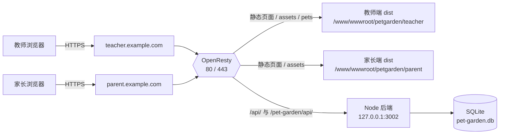

# 生产部署指南（1Panel + OpenResty + systemd，不用 Docker）

> 面向零基础。照着做即可把「教师端 + 家长端 + 后端」全部跑起来。
> 其他文档：
> - 本地打包/改配置 → `LOCAL-BUILD.md`
> - 本地三端联调 → `LOCAL-DEV.md`

---

## 0. 先搞清楚：这个项目到底有几个东西？

这个项目看着是一个仓库，实际运行起来是 **3 个独立部分**：

| 部分 | 源码目录 | 是什么 | 运行方式 |
|------|----------|--------|----------|
| 后端 API | `admin/server` | Node.js + Express，读写数据库 | 服务器上的一个 Node 进程，端口 `3002` |
| 教师端 | `admin`（除 `server` 外的部分） | Vue3 前端，构建后是纯静态文件 | 由 OpenResty 直接托管静态文件 |
| 家长端 | `nest` | Vue3 前端，构建后是纯静态文件 | 由 OpenResty 直接托管静态文件 |

数据库只有一个：**SQLite 单文件**（`pet-garden.db`），由后端进程直接读写，不需要装 MySQL。

部署后的访问链路：



**重点：教师端和家长端都是静态网页，它们没有自己的数据，全部通过 `/api` 找同一个后端。所以后端只需要部署一份。**

---

## 1. 服务器要准备什么

### 1.1 软件清单

| 软件 | 版本要求 | 说明 |
|------|----------|------|
| 1Panel | 任意近期版本 | 已有 |
| OpenResty | 1Panel 应用商店装的即可 | 已有 |
| Node.js | **20.x LTS**（不低于 18） | 需要新装 |

### 1.2 安装 Node.js 20

**方式 A（推荐）：用 1Panel 面板安装**

1Panel → 应用商店 → 搜索 `Node.js` → 安装（选 20 版本）。

**方式 B：命令行安装（以 Ubuntu/Debian 为例）**

```bash
curl -fsSL https://deb.nodesource.com/setup_20.x | bash -
apt install -y nodejs
node -v   # 期望 v20.x
npm -v    # 期望 10.x
```

CentOS / Rocky / AlmaLinux：

```bash
curl -fsSL https://rpm.nodesource.com/setup_20.x | bash -
yum install -y nodejs
node -v
```

### 1.3 准备编译环境（给 better-sqlite3 兜底）

后端用到了 `better-sqlite3`（原生模块）。它**通常能直接下载预编译好的二进制**，但下载失败时会现场编译，所以先把编译环境备好，省得到时候报错：

```bash
# Ubuntu / Debian
apt update && apt install -y python3 make g++

# CentOS / Rocky / AlmaLinux
yum install -y gcc-c++ make python3
```

### 1.4 规划服务器目录

后面所有命令都按这个目录来，你可以改成别的，但**整篇文档要一起改**：

```
/www/wwwroot/petgarden/
├── server/              # 后端代码 + node_modules（不要把整个仓库都扔进来）
│   ├── index.js
│   ├── db.js
│   ├── routes/
│   ├── utils/
│   ├── package.json
│   └── node_modules/
├── teacher/             # 教师端 dist 的内容（直接放 dist 里的文件，不要再套一层 dist）
│   ├── index.html
│   └── assets/
├── parent/              # 家长端 dist 的内容
│   ├── index.html
│   └── assets/
└── data/
    └── pet-garden.db    # ★ 数据库文件（自动生成，别放别处，备份就备份它）
```

创建它：

```bash
mkdir -p /www/wwwroot/petgarden/{server,teacher,parent,data}
mkdir -p /var/log/petgarden
```

---

## 2. 第一步：把后端放上服务器

> ⚠️ **不要在你自己电脑上装好后端的 `node_modules` 再传上来。**
> `better-sqlite3` 是原生模块，Windows 上装出来的二进制在 Linux 上跑不起来。
> **后端依赖必须在服务器上安装。**（前端的 `dist` 是纯静态文件，可以随意在本地构建后上传。）

### 2.1 上传后端源码

把你仓库里的 `admin/server` 目录**里面的内容**上传到 `/www/wwwroot/petgarden/server/`。

需要的只有这些（其他都是测试/日志，可以不要）：

```
admin/server/
├── index.js
├── db.js
├── demo-seed.js
├── package.json
├── package-lock.json
├── middleware/
├── routes/
├── services/
└── utils/
```

上传方式任选其一：

- 1Panel → 文件管理器 → 上传 zip → 解压到该目录
- 本地用 scp（Windows PowerShell / Linux 终端都能用）：
  ```bash
  scp -r admin/server/* root@你的服务器IP:/www/wwwroot/petgarden/server/
  ```
- 服务器上直接 `git clone` 仓库，再把 `admin/server` 拷贝过去

### 2.2 安装后端依赖

```bash
cd /www/wwwroot/petgarden/server
npm ci --omit=dev
```

如果 `npm ci` 因为 lock 文件问题失败，就用：

```bash
npm install --omit=dev
```

验证是否装成功（**这一步最容易出问题，务必做**）：

```bash
node -e "require('better-sqlite3'); console.log('sqlite ok')"
```

看到 `sqlite ok` 再往下走。报错的话看第 9 节的故障排查。

---

## 3. 第二步：配置后端（环境变量 + 数据库位置）

### 3.1 配置文件放哪里（这里很容易搞错）

后端代码里有这么一句：

```js
// admin/server/index.js
process.loadEnvFile(path.resolve(path.dirname(...), '../.env'))
```

意思是：**它读的是 `server` 目录的「上一级目录」里的 `.env` 文件**。

所以按我们的目录规划，`.env` 必须放在：

```
/www/wwwroot/petgarden/.env      ← 对
/www/wwwroot/petgarden/server/.env  ← 错，读不到
```

### 3.2 先生成密钥

```bash
openssl rand -hex 32
```

把输出的一长串字符串记下来，等下填到 `TOKEN_SECRET`。

### 3.3 写 .env

```bash
cat > /www/wwwroot/petgarden/.env <<'EOF'
# ===== 端口 =====
PORT=3002

# ===== 数据库位置（SQLite 单文件）=====
SQLITE_PATH=/www/wwwroot/petgarden/data/pet-garden.db

# ===== 安全（必须改）=====
TOKEN_SECRET=把刚才 openssl 生成的那串粘到这里
ADMIN_DEFAULT_PASSWORD=换成一个强密码

# ===== 生产环境关闭演示数据 =====
DISABLE_DEMO=1

# ===== 家长端域名（教师端「邀请家长」生成的链接会用它）=====
PARENT_APP_BASE_URL=https://parent.example.com

# ===== 认证限流（同一 IP）=====
AUTH_RATE_LIMIT_ENABLED=true
AUTH_LOGIN_RATE_LIMIT_MAX=10
AUTH_LOGIN_RATE_LIMIT_WINDOW_MS=60000
EOF

chmod 600 /www/wwwroot/petgarden/.env
```

### 3.4 每一项是什么意思（改配置看这张表）

| 变量 | 必须？ | 作用 | 改了之后要做什么 |
|------|--------|------|------------------|
| `PORT` | 否（默认 3002） | 后端监听端口 | 重启后端；OpenResty 的 `proxy_pass` 端口要同步改 |
| `SQLITE_PATH` | 是 | **数据库文件放哪** | 重启后端。换路径 = 换了一个空库，旧数据不会跟过来（要搬家就先停服务再复制 db 文件） |
| `TOKEN_SECRET` | **是** | 登录 token 签名密钥 | 重启后端。**改了会让所有人登录态失效**。生产环境不配置会直接报错启动不了 |
| `ADMIN_DEFAULT_PASSWORD` | 建议改 | 后台管理员 `admin` 的密码 | 重启后端（只在首次创建该账号时生效，已存在则不会改） |
| `DISABLE_DEMO` | 建议 `1` | `1` = 不生成演示班级/演示数据 | 重启后端 |
| `PARENT_APP_BASE_URL` | 建议配 | 教师端复制「邀请家长」链接时用的域名，缺了就生成不出链接 | 重启后端 |
| `AUTH_*` | 否 | 登录/注册限流 | 重启后端 |
| `VITE_ADMIN_WECHAT_PHONE`<br>`VITE_WECHAT_PAY_QR_URL` | 否 | VIP 收款联系方式 | **不是运行期变量**，是教师端「构建时」注入的，改了必须重新构建教师端（见 `LOCAL-BUILD.md`） |

> 注意：`.env` 里**不要**写 `VITE_` 开头的变量，那是前端构建用的，写了也没用。

---

## 4. 第三步：把后端做成开机自启的服务（systemd）

不这么做的话，你关掉终端后端就死了。

创建服务文件：

```bash
cat > /etc/systemd/system/petgarden.service <<'EOF'
[Unit]
Description=Class Pet Garden API
After=network.target

[Service]
Type=simple
User=root
WorkingDirectory=/www/wwwroot/petgarden/server
Environment=NODE_ENV=production
ExecStart=/usr/bin/node /www/wwwroot/petgarden/server/index.js
Restart=always
RestartSec=5
StandardOutput=append:/var/log/petgarden/server.log
StandardError=append:/var/log/petgarden/server.log

[Install]
WantedBy=multi-user.target
EOF
```

> `ExecStart` 里的 node 路径可能不是 `/usr/bin/node`，用 `which node` 查一下，改成实际路径。

启动：

```bash
systemctl daemon-reload
systemctl enable --now petgarden      # 开机自启 + 立刻启动
systemctl status petgarden            # 看状态
```

验证：

```bash
curl http://127.0.0.1:3002/api/health
# 期望返回：{"status":"ok","timestamp":...}
```

看到 `ok` 说明后端和数据库都正常了。此时去看一眼数据库文件是否已生成：

```bash
ls -l /www/wwwroot/petgarden/data/
# 应该有 pet-garden.db（以及 -wal、-shm，正常现象）
```

常用命令：

```bash
systemctl restart petgarden     # 改了 .env 或更新代码后执行
systemctl stop petgarden
tail -f /var/log/petgarden/server.log    # 看日志
journalctl -u petgarden -f               # 另一种看日志的方式
```

---

## 5. 第四步：构建并上传两个前端

前端的构建**在你的本地电脑上做**（详见 `LOCAL-BUILD.md`），这里只说结果：

| 前端 | 构建命令（在对应目录执行） | 产物 | 上传到服务器哪里 |
|------|---------------------------|------|------------------|
| 教师端 | `npm ci && npm run build`（目录：`admin`） | `admin/dist/` | `/www/wwwroot/petgarden/teacher/` |
| 家长端 | `npm ci && npm run build`（目录：`nest`） | `nest/dist/` | `/www/wwwroot/petgarden/parent/` |

⚠️ 上传的是 `dist` **里面**的内容（`index.html` + `assets/`），**不要把 `dist` 这一层目录也传进去**。

正确：

```
/www/wwwroot/petgarden/teacher/index.html
/www/wwwroot/petgarden/teacher/assets/xxx.js
```

错误：

```
/www/wwwroot/petgarden/teacher/dist/index.html   ← 多了 dist 一层，会 404
```

如果你嫌本地构建麻烦，也可以在服务器上构建（服务器装好 Node 后，上传完整仓库代码，`cd admin && npm ci && npm run build`），效果一样。

### 5.1 家长端的宠物图片从哪来

家长端显示宠物图片时请求的路径是 `/pets/xxx/lv1.webp`，这些图片**只有教师端的构建产物里有**（教师端 `public/pets` → 构建后 `teacher/pets/`）。

两个办法，任选：

- **办法 A（推荐，省空间）**：在家长端的 OpenResty 配置里把 `/pets/` 指到教师端目录（下面给的家长端配置已经包含这一条）。
- **办法 B**：构建后把教师端的 `dist/pets` 整个复制到家长端目录：
  ```bash
  cp -r /www/wwwroot/petgarden/teacher/pets /www/wwwroot/petgarden/parent/pets
  ```

---

## 6. 第五步：配置 OpenResty（两个网站）

建议用**两个子域名**，比如：

- 教师端：`teacher.example.com`
- 家长端：`parent.example.com`

> 也可以用同一个域名（如 `example.com` 和 `example.com/parent`），但家长端要改 Vite 的 `base` 和路由 base，比较麻烦，小白请直接用两个子域名。
> 先做 HTTP（80）跑通，最后再上 HTTPS。

### 6.1 用 1Panel 建两个「静态网站」

1Panel → 网站 → 创建网站：

- 类型选 **静态网站**（不要选 PHP / 反向代理）
- 域名填 `teacher.example.com`
- 根目录（运行目录）：填 `/www/wwwroot/petgarden/teacher`
  （如果面板不允许改，就用它默认给的目录，比如 `/www/wwwroot/teacher.example.com/index`，把 dist 内容传到那里，并把下面配置里的 `root` 改成那个路径）
- 同样方式再建一个 `parent.example.com`，根目录 `/www/wwwroot/petgarden/parent`

然后：网站 → 对应站点 → **配置文件**，把里面的 `server { ... }` 内容替换成下面给的配置（保留面板自己生成的 ssl 段落即可，没有 ssl 就不管）。

### 6.2 教师端配置

```nginx
server {
    listen 80;
    server_name teacher.example.com;

    root /www/wwwroot/petgarden/teacher;
    index index.html;

    # 日志（可选）
    access_log /var/log/petgarden/teacher.access.log;
    error_log  /var/log/petgarden/teacher.error.log;

    # gzip 压缩
    gzip on;
    gzip_vary on;
    gzip_min_length 1024;
    gzip_proxied any;
    gzip_types text/plain text/css application/json application/javascript
               text/javascript image/svg+xml image/png image/jpeg image/webp;

    client_max_body_size 20m;

    # ---- 接口转发到 Node 后端（端口要和 .env 里的 PORT 一致）----
    # 教师端代码里写死的接口前缀就是 /pet-garden/api，必须转发
    location /pet-garden/api/ {
        proxy_pass http://127.0.0.1:3002;
        proxy_http_version 1.1;
        proxy_set_header Host $host;
        proxy_set_header X-Real-IP $remote_addr;
        proxy_set_header X-Forwarded-For $proxy_add_x_forwarded_for;
        proxy_set_header X-Forwarded-Proto $scheme;
        proxy_read_timeout 60s;
    }

    # 兼容 /api 前缀（家长端/分享页等会用到）
    location /api/ {
        proxy_pass http://127.0.0.1:3002;
        proxy_http_version 1.1;
        proxy_set_header Host $host;
        proxy_set_header X-Real-IP $remote_addr;
        proxy_set_header X-Forwarded-For $proxy_add_x_forwarded_for;
        proxy_set_header X-Forwarded-Proto $scheme;
    }

    # ---- 带 hash 的静态资源：长期缓存 ----
    location /assets/ {
        expires 1y;
        add_header Cache-Control "public, immutable";
        try_files $uri =404;
    }

    location ~* \.(png|jpe?g|gif|webp|svg|ico|woff2?|mp3)$ {
        expires 30d;
        add_header Cache-Control "public";
    }

    # ---- HTML 不要缓存 ----
    location = /index.html {
        add_header Cache-Control "no-cache";
    }

    # ---- SPA 回退：刷新子页面不会 404（必须保留）----
    location / {
        try_files $uri $uri/ /index.html;
    }
}
```

### 6.3 家长端配置

```nginx
server {
    listen 80;
    server_name parent.example.com;

    root /www/wwwroot/petgarden/parent;
    index index.html;

    access_log /var/log/petgarden/parent.access.log;
    error_log  /var/log/petgarden/parent.error.log;

    gzip on;
    gzip_vary on;
    gzip_min_length 1024;
    gzip_proxied any;
    gzip_types text/plain text/css application/json application/javascript
               text/javascript image/svg+xml image/png image/jpeg image/webp;

    # ---- 接口转发到同一个后端 ----
    # 家长端的接口前缀默认是 /api（由构建期变量 VITE_API_BASE 控制，默认 /api）
    location /api/ {
        proxy_pass http://127.0.0.1:3002;
        proxy_http_version 1.1;
        proxy_set_header Host $host;
        proxy_set_header X-Real-IP $remote_addr;
        proxy_set_header X-Forwarded-For $proxy_add_x_forwarded_for;
        proxy_set_header X-Forwarded-Proto $scheme;
    }

    # 兼容教师端前缀
    location /pet-garden/api/ {
        proxy_pass http://127.0.0.1:3002;
        proxy_http_version 1.1;
        proxy_set_header Host $host;
        proxy_set_header X-Real-IP $remote_addr;
        proxy_set_header X-Forwarded-For $proxy_add_x_forwarded_for;
        proxy_set_header X-Forwarded-Proto $scheme;
    }

    # ---- 宠物图片：直接读教师端构建产物里的图片 ----
    location /pets/ {
        alias /www/wwwroot/petgarden/teacher/pets/;
        expires 30d;
        add_header Cache-Control "public";
    }

    location /assets/ {
        expires 1y;
        add_header Cache-Control "public, immutable";
        try_files $uri =404;
    }

    location = /index.html {
        add_header Cache-Control "no-cache";
    }

    # ---- SPA 回退 ----
    location / {
        try_files $uri $uri/ /index.html;
    }
}
```

> 注意 `location /pets/ { alias .../teacher/pets/; }`：`location` 和 `alias` 的**结尾斜杠必须成对出现**，写错会导致 404。

### 6.4 让配置生效

1Panel 里保存配置文件后一般会自动重载；也可以在服务器上执行：

```bash
# 先检查语法
openresty -t 2>/dev/null || nginx -t
# 通过后再重载
systemctl reload openresty 2>/dev/null || nginx -s reload
```

### 6.5 文件权限

静态文件要能被 OpenResty（一般是 `www-data` 用户）读到：

```bash
chown -R www-data:www-data /www/wwwroot/petgarden/teacher /www/wwwroot/petgarden/parent
find /www/wwwroot/petgarden/teacher /www/wwwroot/petgarden/parent -type d -exec chmod 755 {} \;
find /www/wwwroot/petgarden/teacher /www/wwwroot/petgarden/parent -type f -exec chmod 644 {} \;
```

不确定 OpenResty 用哪个用户时，查一下：

```bash
ps aux | grep nginx | head -3
```

### 6.6 上 HTTPS（强烈建议）

1Panel → 网站 → 选站点 → 证书 → 申请 Let's Encrypt 证书（需要域名已解析到本机、80 端口可访问）→ 开启「强制 HTTPS」。

面板会自动帮你改好 443 配置和重定向，你加的 `location` 规则会保留。

---

## 7. 数据库在哪？怎么备份？

### 7.1 位置

就是 `SQLITE_PATH` 指向的那个文件：

```
/www/wwwroot/petgarden/data/pet-garden.db
```

同目录下还会出现 `pet-garden.db-wal`、`pet-garden.db-shm`，这是 SQLite 的正常临时文件，**不要删**。

**数据库不要放在 `/tmp`、`/root` 或者代码目录里**（代码目录重新上传时容易被覆盖）。放在 `data/` 这种独立目录最安全。

### 7.2 备份

SQLite 直接拷贝文件即可，但服务正在写时有 `-wal` 文件，推荐用 `sqlite3` 的安全备份命令：

```bash
cat > /usr/local/bin/petgarden-backup.sh <<'EOF'
#!/bin/bash
set -e
DIR=/www/wwwroot/petgarden/backup
mkdir -p $DIR
STAMP=$(date +%Y%m%d_%H%M%S)
sqlite3 /www/wwwroot/petgarden/data/pet-garden.db ".backup '$DIR/pet-garden-$STAMP.db'"
gzip $DIR/pet-garden-$STAMP.db
# 只保留最近 30 天
find $DIR -name "pet-garden-*.db.gz" -mtime +30 -delete
EOF

chmod +x /usr/local/bin/petgarden-backup.sh
```

没有 `sqlite3` 命令就装一个：`apt install -y sqlite3` 或 `yum install -y sqlite`。

加到定时任务（每天凌晨 3 点）：

```bash
crontab -e
# 加这一行
0 3 * * * /usr/local/bin/petgarden-backup.sh
```

也可以在 1Panel → 计划任务 → Shell 脚本 里填 `/usr/local/bin/petgarden-backup.sh`，周期选每天。

### 7.3 恢复

```bash
systemctl stop petgarden
gunzip -c /www/wwwroot/petgarden/backup/pet-garden-20260101_030000.db.gz > /www/wwwroot/petgarden/data/pet-garden.db
rm -f /www/wwwroot/petgarden/data/pet-garden.db-wal /www/wwwroot/petgarden/data/pet-garden.db-shm
systemctl start petgarden
```

> 恢复后所有人需要重新登录，正常。

### 7.4 另一种备份：用系统自带功能

教师端里有「数据管理 → 导出备份/导入恢复」，会导出 JSON 文件，适合迁移单个班级，但不能替代整库备份。

---

## 8. 验收清单（逐条打勾）

```bash
# 1. 后端活着
curl http://127.0.0.1:3002/api/health          # {"status":"ok",...}

# 2. 教师端页面能打开
curl -I http://teacher.example.com/            # 200

# 3. 家长端页面能打开
curl -I http://parent.example.com/             # 200

# 4. 教师端接口通（走域名）
curl http://teacher.example.com/pet-garden/api/health   # {"status":"ok",...}

# 5. 家长端接口通
curl http://parent.example.com/api/health               # {"status":"ok",...}

# 6. 宠物图片能访问
curl -I http://parent.example.com/pets/bichon/lv1.webp  # 200
```

浏览器里再确认：

- [ ] 教师端能注册/登录，能建班级、加学生、加分
- [ ] 教师端刷新页面（比如 `/ranking`）不会 404
- [ ] 教师端「邀请家长」能复制出 `https://parent.example.com/?classId=xxx` 这样的链接
- [ ] 家长端打开该链接能看到孩子，能设密码登录
- [ ] 家长端宠物图片正常显示（不是空白/裂图）

---

## 9. 出问题了怎么办（按现象查）

| 现象 | 原因 / 解决办法 |
|------|-----------------|
| `systemctl status petgarden` 是 failed，日志写 `生产环境必须配置 TOKEN_SECRET 环境变量` | `.env` 没读到。检查文件是不是放在 `server` 的**上一级**目录、`TOKEN_SECRET` 有没有真的填 |
| 日志 `SQLITE_CANTOPEN` | `data` 目录不存在或没写权限：`mkdir -p /www/wwwroot/petgarden/data` |
| `Error: Cannot find module 'better-sqlite3'` | 依赖没装好。回到 2.2 节重装；若报编译错误，先装 `python3 make g++` 再 `npm install --omit=dev` |
| 页面能开但一直转圈、接口 502 | 后端没起来，或 `proxy_pass` 端口写错。`curl 127.0.0.1:3002/api/health` 先确认后端 |
| 打开首页正常，刷新子页面 404 | OpenResty 少了 `try_files $uri $uri/ /index.html;` |
| 页面白屏，F12 控制台一堆 404 | dist 传错位置（多套了一层 `dist`），或 `root` 路径写错 |
| 家长端宠物图片全裂图 | `/pets/` 的 location 没配或 `alias` 路径写错（见 6.3） |
| 教师端复制邀请链接是空的 | `.env` 里没配 `PARENT_APP_BASE_URL`，配完 `systemctl restart petgarden` |
| 注册时提示操作太频繁 | 限流生效了。`AUTH_REGISTER_RATE_LIMIT_MAX` 默认 1 次/小时，可在 `.env` 调大（如 20）后重启 |
| 改了 `.env` 没生效 | 必须 `systemctl restart petgarden` |
| 改了 `VITE_*` 没生效 | 那是构建期变量，必须重新构建前端并重新上传 dist（见 `LOCAL-BUILD.md`） |
| 更新后页面还是旧的 | 浏览器强刷 `Ctrl+F5`；`index.html` 已设为不缓存，但用户浏览器可能有旧缓存 |

**看日志是第一生产力：**

```bash
tail -100 /var/log/petgarden/server.log        # 后端
tail -100 /var/log/petgarden/teacher.error.log # 教师端 nginx 错误
```

---

## 10. 以后怎么更新发版

```bash
# 1. 本地重新构建两个前端（见 LOCAL-BUILD.md），得到新的 dist

# 2. 上传覆盖服务器上的 teacher/ 和 parent/ 目录内容
#    （用 1Panel 文件管理器上传 zip 覆盖解压，或 scp）

# 3. 如果后端代码也改了：上传 server 目录后重装依赖
cd /www/wwwroot/petgarden/server && npm ci --omit=dev

# 4. 重启后端
systemctl restart petgarden

# 5. 重载 OpenResty（配置没改就不用）
systemctl reload openresty

# 6. 验证
curl http://127.0.0.1:3002/api/health
```

**更新不会动到数据库**（数据库在 `data/` 目录，不在代码目录里），这就是把数据库单独放的好处。

---

## 11. 安全建议（别跳过）

1. **不要**在服务器防火墙/安全组里放通 3002 端口，接口只允许本机 OpenResty 访问。
2. `.env` 权限设成 `600`，别提交到 Git。
3. `TOKEN_SECRET` 用 `openssl rand -hex 32` 生成，不要用简单字符串。
4. `ADMIN_DEFAULT_PASSWORD` 必须改掉默认的 `admin!@#$`。
5. 上 HTTPS，并开启强制跳转。
6. 定期备份数据库，并**把备份文件下载到本地一份**（只留在服务器上等于没备份）。
