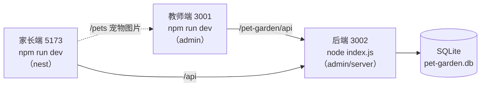

# 本地联调教程（教师端 + 后端 + 家长端）

> 目标：在你自己电脑上把三个进程同时跑起来，改代码能立刻看到效果。
> 要打包发布看 `LOCAL-BUILD.md`；要部署到服务器看 `DEPLOY-PRODUCTION.md`。

---

## 1. 三个进程的关系

本地完整跑起来需要**同时开三个进程**，缺一个功能就不完整：

| 进程 | 目录 | 端口 | 启动命令 | 作用 |
|------|------|------|----------|------|
| ① 后端 API | `admin/server` | **3002** | `node index.js` | 唯一的数据来源，读写 SQLite |
| ② 教师端前端 | `admin` | **3001** | `npm run dev` | 老师用的界面；同时提供宠物图片 `/pets` |
| ③ 家长端前端 | `nest` | **5173** | `npm run dev` | 家长用的界面 |



> ⚠️ 家长端的宠物图片是向教师端的开发服务器（3001）要的，所以**只启动家长端不启动教师端，宠物图片会是裂图**。

---

## 2. 第一次：安装依赖（三个目录各自装）

以源码在 `D:\deploy\chongWu` 为例（换成你自己的路径）：

```powershell
cd D:\deploy\chongWu\admin
npm ci

cd D:\deploy\chongWu\admin\server
npm ci          # 后端依赖（better-sqlite3 会在这步下载/编译）

cd D:\deploy\chongWu\nest
npm ci
```

> `admin\server` 的 `npm ci` 如果卡在 `better-sqlite3` 编译，多半是缺编译环境。
> Windows 上最省事的办法：安装 Visual Studio 生成工具（`npm install -g windows-build-tools` 已废弃），
> 或直接在 PowerShell(管理员) 执行：
> ```powershell
> npm install --global windows-build-tools
> ```
> 不行就装 [Visual Studio Community](https://visualstudio.microsoft.com/) 并勾选「使用 C++ 的桌面开发」。

---

## 3. 配置本地后端（可选，但建议做）

本地后端读的配置文件是 `admin/.env`（因为代码里读的是 `server` 目录的上一级）。

**默认不建 `.env` 也能跑**（会用默认值：端口 3002，数据库 `admin/server/pet-garden.db`，并且**会生成演示班级**）。

如果你想自定义（比如换数据库位置、登录演示账号），在 `admin/.env` 写：

```ini
PORT=3002
# 数据库文件放哪（默认就是 admin/server/pet-garden.db）
SQLITE_PATH=./data/pet-garden.db
# 管理员后台密码
ADMIN_DEFAULT_PASSWORD=admin!@#$
# 本地想看演示班级就别设 DISABLE_DEMO=1；设了就不生成演示数据
# DISABLE_DEMO=1
# 教师端「邀请家长」生成的链接前缀，本地联调填家长端地址
PARENT_APP_BASE_URL=http://localhost:5173
```

> `SQLITE_PATH` 写成相对路径时，是相对于**启动命令所在的目录**。用 `npm run server`（在 `admin` 目录执行）时，`./data/pet-garden.db` 指的是 `admin/data/pet-garden.db`。建议直接写绝对路径最省心，例如 `D:/deploy/chongWu/data/pet-garden.db`。

---

## 4. 启动（开三个终端）

建议三个 PowerShell / 终端窗口各跑一个，方便看日志。

**终端 ① 后端**

```powershell
cd D:\deploy\chongWu\admin
npm run server          # = node --watch --env-file=.env server/index.js，改后端代码会自动重启
```

不需要热更新也可以：

```powershell
cd D:\deploy\chongWu\admin\server
node index.js
```

**终端 ② 教师端**

```powershell
cd D:\deploy\chongWu\admin
npm run dev
```

**终端 ③ 家长端**

```powershell
cd D:\deploy\chongWu\nest
npm run dev
```

> 也可以用 `npm start`（在 `admin` 目录）一次性并行拉起教师端 + 后端，但日志会混在一起，新手建议分开。

### 确认都起来了

```powershell
(Invoke-WebRequest http://localhost:3002/api/health -UseBasicParsing).Content   # {"status":"ok",...}
(Invoke-WebRequest http://localhost:3001/ -UseBasicParsing).StatusCode          # 200
(Invoke-WebRequest http://localhost:5173/ -UseBasicParsing).StatusCode          # 200
```

浏览器访问：

| 端 | 地址 |
|----|------|
| 教师端 | http://localhost:3001 |
| 家长端 | http://localhost:5173 |

---

## 5. 怎么用（联调自测路径）

1. **教师端** http://localhost:3001
   - 首次会创建一个游客/演示账号，直接可用；
   - 若 `.env` 没设 `DISABLE_DEMO=1`，启动后端时会自动建一个演示班级，可直接用演示账号登录（见后端启动日志输出）；
   - 建班级 → 加学生 → 给学生加分 → 看排行榜。
2. **邀请家长**：教师端里复制邀请链接，链接形如
   `http://localhost:5173/?classId=xxxx`（基址由 `PARENT_APP_BASE_URL` 决定，没配就复制不出来）。
3. **家长端**：打开该链接 → 选择/绑定孩子 → 首次设置家长密码 → 登录 → 查看积分、领养宠物。
4. **直接进学生页**：http://localhost:5173/student/{学生ID}
5. **管理员后台**：教师端 `/manage` 路由，用 `admin` + `ADMIN_DEFAULT_PASSWORD` 登录。

后端默认管理员账号：`admin`，密码默认 `admin!@#$`（由 `ADMIN_DEFAULT_PASSWORD` 决定）。

---

## 6. 停止

**方式 A**：每个终端 `Ctrl + C`。

**方式 B**：按端口直接杀（不用找窗口）：

```powershell
foreach ($p in @(3001,3002,5173)) {
  Get-NetTCPConnection -LocalPort $p -ErrorAction SilentlyContinue | ForEach-Object {
    if ($_.OwningProcess -ne 0) { Stop-Process -Id $_.OwningProcess -Force }
  }
}
```

Linux / macOS：

```bash
lsof -ti:3001,3002,5173 | xargs -r kill
```

---

## 7. 调试小贴士

### 7.1 家长端宠物图片裂图

家长端请求的图片路径是 `/pets/xxx/lv1.webp`，本地由 `nest/vite.config.ts` 代理到 `http://localhost:3001`。
所以**教师端 dev（3001）必须开着**。

如果不想开教师端，把教师端的图片目录复制到家长端的 public 下（注意会进入 Git）：

```powershell
Copy-Item D:\deploy\chongWu\admin\public\pets D:\deploy\chongWu\nest\public\pets -Recurse -Force
```

### 7.2 接口代理规则在哪改

- 教师端：`admin/vite.config.ts` → `/pet-garden/api` → `http://localhost:${API_PORT}`（默认 3002）。
  改后端端口时用环境变量：
  ```powershell
  $env:API_PORT = 3002; npm run dev
  ```
- 家长端：`nest/vite.config.ts` → `/api`、`/pet-garden/api` → `http://localhost:3002`，`/pets` → `http://localhost:3001`。

### 7.3 演示数据每天会被重置

后端有个定时任务（每天重置演示班级数据），本地联调时发现演示班级数据"自己变了"是正常的。
不想生成/重置演示数据：在 `admin/.env` 设 `DISABLE_DEMO=1` 后重启后端。

### 7.4 想清空本地数据重来

最简单：停掉后端，删掉数据库文件，再启动（会自动重建表结构）：

```powershell
Remove-Item D:\deploy\chongWu\admin\server\pet-garden.db* -Force -ErrorAction SilentlyContinue
```

（如果你用 `SQLITE_PATH` 指定到别处，删那个文件。）

### 7.5 常见报错

| 现象 | 原因 / 处理 |
|------|-------------|
| `EADDRINUSE: address already in use :::3002` | 端口被占用，用第 6 节的方式 B 杀掉 |
| 教师端页面白屏 | 后端没起，或 3002 被占；先看终端 ① 的日志 |
| 家长端接口 404/500 | 后端没起；确认 `curl localhost:3002/api/health` |
| 注册提示「操作太频繁」 | 限流生效，默认 1 次/小时。本地可在 `admin/.env` 设 `AUTH_REGISTER_RATE_LIMIT_MAX=999` 后重启后端 |
| 改了 `.env` 没生效 | 重启后端进程（`--watch` 不会监听 `.env` 变化） |
| `npm run build` 报 TS 类型错误 | 先把类型错误修掉，或临时用 `npx vite build` 只做打包 |
